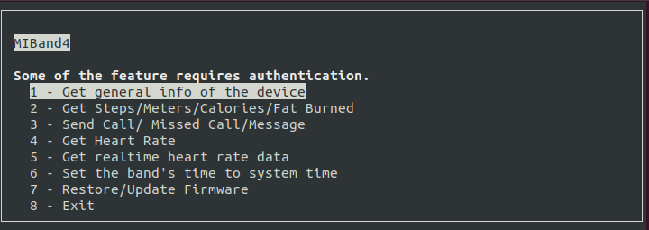

 


# MIBAND 4 - Python Library

> Library to interact with Xiaomi MiBand4. 
> Only works on linux.


## Updates(3/1/2021)
- Alarm functionality. 

## Updates(10/27/2020)
- (New Feature) Custom watchface files(.bin) support. 
- Firmware restore/update fixes.

## Contributors 

 MiBand 4 provides superset of services provided by MiBand 2/3. For the services that were similar for both devices, the bluetooth characteristics, UUIDs  and request/response byte sequence were the same. Therefore,  I utilized some of the informations already uncovered by [Freeyourgadget team](https://github.com/Freeyourgadget/Gadgetbridge) and made use of the code by [Andrey Nikishaev](https://github.com/creotiv) for MiBand2. I reverse engineered snooped ACL packets to fill in the pieces of the puzzle. 


## AuthKey
MiBand 4 with updated firmware requires server based pairing. This means, that you absolutely must use MiFit app to make the initial pairing, retrieve the pairing key and then use this key to pair with this library. Only some of the features of this library work without AuthKey of the band. Read [Server based pairing](https://github.com/Freeyourgadget/Gadgetbridge/wiki/Huami-Server-Pairing) for further details.

There are several ways to obtain the key.

#### Obtaining unique Authkey
On **rooted phone** you may grab the key from MiFit database which means that you must:

- install MiFit
- create an account
- pair the band/watch
- Then, execute the following command in a root shell terminal:
```
sqlite3 /data/data/com.xiaomi.hm.health/databases/origin_db_[YOURDBNAMEHERE] "select AUTHKEY from DEVICE"
```
On a **non rooted phone** you may consider using https://www.freemyband.com/ 

**NOTICE**: Every time you hard reset the band/watch, the Bluetooth MAC Address will be changed and you must grab a new key! Also, anytime you unpair your band/watch from MiFit, the pairing key will be invalidated and you must make new pairing in MiFit app.

### Features that work without authkey
- Sending Calls
- Sending alerts
- Sending Missed call notifications
- Retrieving device info
- Sending music title and music state(Playing/Paused)
- Recieve music control events (Play/Pause/Forward/Backward/Volume Up/Volume Down/Enter Music app/ Exit Music app) through callbacks
### Features that needs authkey
- Updating watchface of the band
- Retrieving heart rate (Realtime and Single time)
- Firmware update/restore (This feature has the potential to brick your Mi Band 4. Do it at your own risk)
- Retrieving steps count, calories count and fat burnt
- Setting date and time
- Fetching fitness data within certain past intervals.


# Setup and demo


- Clone this repo to your local machine using `https://github.com/satcar77/miband4.git`


1.  Install the dependencies. Libglib2 is required for bluepy. 

    ```
    sudo apt-get install libglib2.0-dev
    pip3 install -r requirements.txt
    ```
2. (**Optional**) Find AuthKey for your device and put it to `auth_key.txt` file in the current directory with the script. 

3.  Turn off your Bluetooth on your mobile device paired with MIBand 4

4.  Find out your MiBand4 MAC address using hcitool

    ```
    sudo hcitool lescan
    // if you are having trouble
    sudo hciconfig hci0 reset 
	```
5.  Run the miband4_console

    ```
    python3 miband4_console.py -m MAC_ADDRESS 
	```


## Contributing


#### Step 1

- **Option 1**
    - 🍴 Fork this repo!

- **Option 2**
    - 👯 Clone this repo to your local machine

#### Step 2

- **HACK AWAY!** 🔨🔨🔨

#### Step 3

- 🔃 Create a new pull request


